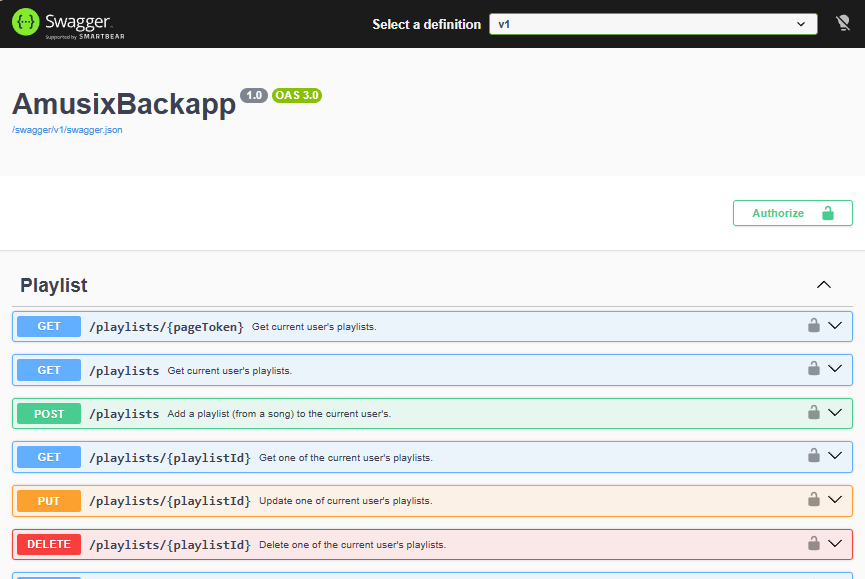

= Amusix Backend Application
:icons: font
:toc:
:toclevels: 5

== Stack

=== Main stack

* https://dotnet.microsoft.com/download/dotnet/10.0[.NET Core 10] (Web API)
* https://learn.microsoft.com/ef/[Entity Framework Core 10]

=== External NuGet dependencies

* https://www.nuget.org/packages/Npgsql.EntityFrameworkCore.PostgreSQL/10.0.3[`Npgsql.EntityFrameworkCore.PostgreSQL` (10.0.3)]: PostgreSQL database connection
* https://www.nuget.org/packages/Bogus/35.6.5[`Bogus` (35.6.5)]: fake data seeding
* https://www.nuget.org/packages/Google.Apis.YouTube.v3/1.75.0.4205[`Google.Apis.YouTube.v3` (1.75.0.4205)]: interactions with YouTube API
* Identity (authentication / security management):
** https://www.nuget.org/packages/Microsoft.AspNetCore.Identity.EntityFrameworkCore/10.0.9[`Microsoft.AspNetCore.Identity.EntityFrameworkCore` (10.0.9)]
** https://www.nuget.org/packages/Microsoft.AspNetCore.Identity.UI/10.0.9[`Microsoft.AspNetCore.Identity.UI` (10.0.9)]
* Swagger (API documentation and testing):
** https://www.nuget.org/packages/Swashbuckle.AspNetCore.Filters/10.0.1[`Swashbuckle.AspNetCore.Filters` (10.0.1)]
** https://www.nuget.org/packages/Swashbuckle.AspNetCore.Swagger/10.2.3[`Swashbuckle.AspNetCore.Swagger` (10.2.3)]
** https://www.nuget.org/packages/Swashbuckle.AspNetCore.SwaggerGen/10.2.3[`Swashbuckle.AspNetCore.SwaggerGen` (10.2.3)]
** https://www.nuget.org/packages/Swashbuckle.AspNetCore.SwaggerUI/10.2.3[`Swashbuckle.AspNetCore.SwaggerUI` (10.2.3)]

== File structure

* `Controllers/`: controllers defining API routes
** User management
** Playlist management
** Song researching
* `Data/`:
** `Migrations/`: ordered Entity Framework migrations
** `Models/`: entities implementing the database model
*** Users
*** Playlists
*** Songs
** `AppDbContext.cs`: database context configuration
** `DataSeeder.cs`: fake data seeder
* `Shared/`: shared resources (view models, classes, constants, etc.)
* `appsettings(.*).json`: configuration files
* `Program.cs`: application startup file

== Setup

=== Dependency installation

. Install .NET Core
. Install Entity Framework command line CLI by running the following command in a terminal:
+
[source,bash]
----
dotnet tool install --global dotnet-ef
----

=== Configuration files

. Add / edit the configurations files at the backend project's root:
+
* `appsettings.Development.json`: local development environment configuration
* `appsettings.Production.ts`: production configuration file

. Add / replace the following fields in the files:
+
* `ConnectionStrings`:
** `Default`: application PostgreSQL database connection string
* `AllowedOrigins`: comma separated list of the origins allowed to send request to the API (ex: `http://localhost:4200`)
* `SeedDatabase`: if the database should be filled with fake data (for testing)
* `YouTubeApi`:
** `ApiKey`: Google Cloud (YouTube) https://docs.cloud.google.com/docs/authentication/api-keys[API key]
** `ApplicationName`: Google Cloud application name

=== Migrate database model

Amusix's backend application uses Entity Framework ORM to implement the database model via entities and migrations.

Run the command bellow at the backend project's root in a terminal to :

. Create the Amusix database if it doesn't exist yet
. Apply the latest migrations to the database

[source,bash]
----
dotnet ef database update
----

WARNING: As some migrations may cause data loss when being applied, it is advised to save database backups before each update!

== Launch

Run the following command at the backend project's root in a terminal to launch the application in a local development environment:

[source,bash]
----
dotnet run
----

Default access URL: http://localhost:5211

== Build

Run the following command at the backend project's root in a terminal to build the application for a production environment:

[source,bash]
----
dotnet publish -c Release -o <output-directory-path> -r <runtime>
----

* Replace `<output-directory-path>` with the path of the directory that will contain the generated the build files
* Replace `<runtime>` with the RID (runtime identifier) of the corresponding runtime (ex: `win-x64`)
** If not specified, your current OS runtime will be used by default
** https://learn.microsoft.com/en-us/dotnet/core/rid-catalog[See more about .NET RID]

NOTE: Using the `-o` argument, might display a warning when using the command. This application isn't involved by the specified issue, so you can just ignore it.

== Documentation and testing with Swagger

=== Overview

When launching the application in a local development environment, all available routes implemented by the controllers are documented and can be tested with the configured Swagger interface.

Default access URL: http://localhost:5211/docs

=== Sign in to use private routes

Some routes are private and can't be accessed without signin in. 

. Create a user account via the `/users/register` route (or use an existing one for the up-coming step)
. Use your credential to log in via the `/users/login` route -> If the authentication succeed, a private `accessToken` will be returned
. Click the "Authorize" button at the top right of the page
. In the displayed modal, enter `Bearer` followed by a blank space followed by the previously returned token, than click "Authorize" and close the modal
. You will now be able to request private routes (according to your user permissions)