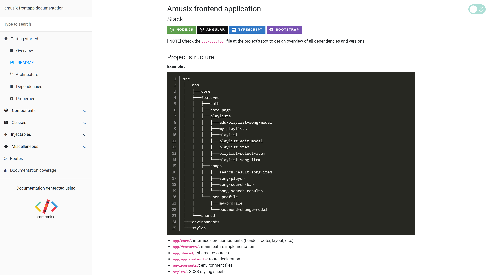

# Amusix frontend application

## Stack

<a href="https://nodejs.org"></a>
<a href="https://angular.dev"></a>
<a href="https://www.typescriptlang.org"></a>
<a href="https://getbootstrap.com"></a>

> [!NOTE]
> Check the `package.json` file at the project's root to get an overview of all dependencies and versions.

## Project structure

```
src
├───app
│   ├───core
│   ├───features
│   │   ├───auth
│   │   ├───home-page
│   │   ├───playlists
│   │   │   ├───add-playlist-song-modal
│   │   │   ├───my-playlists
│   │   │   ├───playlist
│   │   │   ├───playlist-edit-modal
│   │   │   ├───playlist-item
│   │   │   ├───playlist-select-item
│   │   │   └───playlist-song-item
│   │   ├───songs
│   │   │   ├───search-result-song-item
│   │   │   ├───song-player
│   │   │   ├───song-search-bar
│   │   │   └───song-search-results
│   │   └───user-profile
│   │       ├───my-profile
│   │       └───password-change-modal
│   └───shared
├───environments
└───styles
```

* `app/core/`: interface core components (header, footer, layout, etc.)
* `app/features/`: main feature implementation
* `app/shared/`: shared resources
* `app/app.routes.ts`: route declaration
* `environments/`: environment files
* `styles/`: SCSS styling sheets

## Startup (for development)

### Setup

1. Install [Node.js](https://nodejs.org) (if necessary)

2. Install all project dependencies by running the following command at the project's root in a terminal:
   ```shell
    npm i
    ```

### Run

Launch the application in a local development server by running the following command at the project's root in a terminal:

```shell
ng serve
```

> Access URL: http://localhost:4200

## Technical documentation

A detailed technical documentation (architecture, component details, routes and way more) was generated using [compodoc](https://compodoc.app/) and deployed on GitHub Pages.



> Access URL: https://tilianh.github.io/Amusix/docs/frontend
