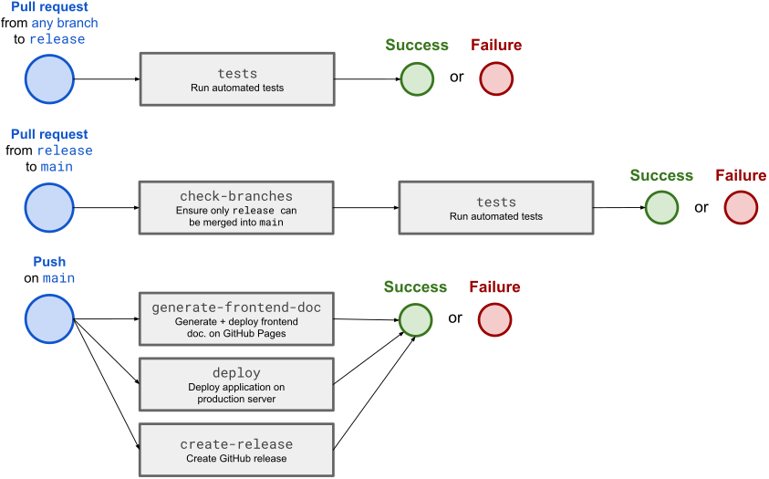
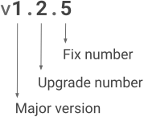

# Contributing guidelines

**Wanna contribute to the Amusix development journey?
Take a look at the guidelines described here and help keep this repository alive and clean.**

## Any feedback? Open an issue!

Any new bug or vulnerability to report?
A new feature you'd like to see in Amusix?
[Open an issue!](https://github.com/Tilianh/Amusix/issues/new)

## Code contribution

Wanna put your hands in Amusix's code? Here are the steps to follow for code contribution:

> [!TIP]
> Check the `README.md` file of the `AmusixFrontapp/`, `AmusixBackapp/` and `tests/` directories to know more on how to set up and run the application for development.

1. Create a fork of this GitHub repository

2. Create your branch:
    * You can create a branch from an issue
    * Name your branch however you want, just know that `main` and `release` are reserved
    * Make sure your branch name is short but 'explicit enough'

3. Enhancements, fixes → code what you have in mind

4. Implement tests in `test/`:
    * Implement or update the tests that cover your code to prevent regression
    * Check the [test directory `README.md` file](tests/README.md) to know where to add your tests and how to locally run them
    * Test your tests and your code to ensure everything works fine

5. Push your changes, use explicite descriptions for your commits

6. Open a pull request from your branch into the `release` branch (tests will be automatically run to ensure there is no regression in your code)

7. Wait for your branch to be approved, and maybe your contribution will make it into the next release!

## Release workflow

Just so you know, here are the steps that are followed to release a new version of Amusix:

1. Branches corresponding to features and fixes are selected to be included in the next version of the application → the selected branches are merged into `release`

2. The [application version is incremented](#version-numbering) in the `package.json` file at the root of the `AmusixFrontapp/` directory

3. When everything is ready, the `release` branch is merged into `main` via a pull request

4. Tests are automatically run to ensure all changes have been correctly merged and the application still works fine

When the pull request is accepted and all the changes are merged into `main`, the repo CI / CD pipelines will automatically:

1. Generate and deploy the frontend documentation in GitHub Pages

2. Deploy the new version on the production server:
    1. Connect to the server
    2. Create a backup of the database
    3. Pull all the changes brought in the new version
    4. Rebuild and launch the dockerized application with the changes

3. Push a new GitHub release

### GitHub Actions worfklow chart

### Version numbering

Here's an explanation of how what the digits mean for each version of the application:

