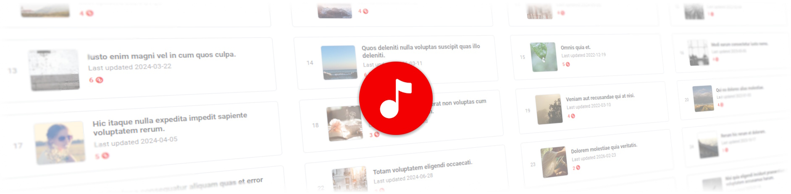
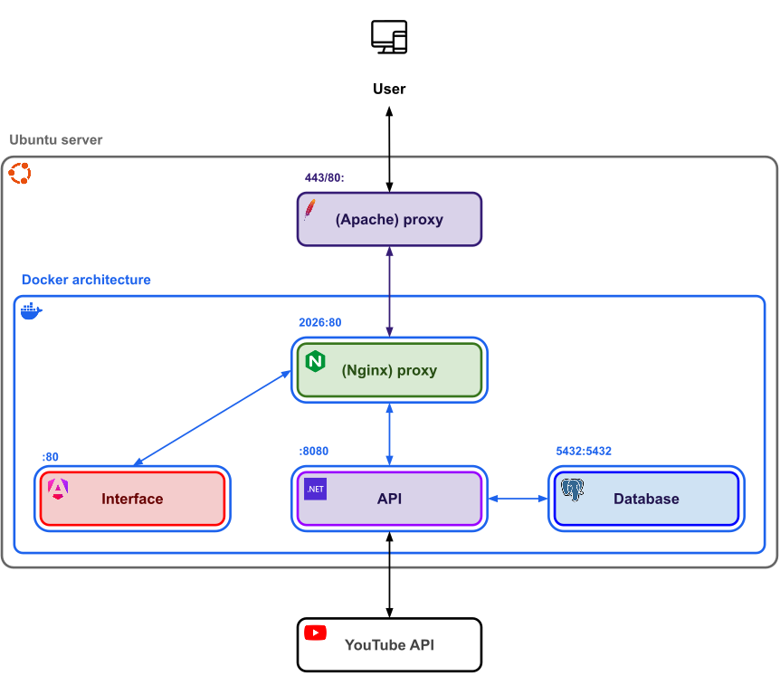

<picture>
    
</picture>
<br>
<br>

# Amusix

**Welcome to Amusix's GitHub repository. Here you'll find everything you need to know about the application's code and how you can contribute to improve it!**

## What is Amusix?

Amusix in an application powered by the YouTube API to listen to and share music playlists with your friends.

It mainly relies on:

<a href="https://dotnet.microsoft.com/download/dotnet"></a>
<a href="https://angular.dev"></a>
<a href="https://www.postgresql.org"></a>

## User guide

Wanna know how to use Amusix? Check the repo's [user guide](docs/USER_GUIDE.md).

## Architecture

### Diagram



* The dockerized application is deployed on an [Ubuntu](https://ubuntu.com/) server
* An [Apache](https://httpd.apache.org/) proxy on the server redirects user requests to the application's Nginx proxy
* The application's [Nginx](https://nginx.org/) proxy redirects the requests to either the frontend or backend container:
    *  `/` → redirects to the frontend
    *  `/api/` → redirects to the API
* The application's backend manages requests with the database and the YouTube API (used to retrieve song metadata)

> [!NOTE]
> Other applications were already hosted on the server and served using Apache before Amusix's deployment.
> That's why we use an Apache proxy rather than directly redirecting user requests to the Nginx proxy.
> The Apache proxy also manages HTTPS redirections to ensure the application's pages are SSL certified.

### Project structure

* [`AmusixBackapp/`](AmusixBackapp): backend application
* [`AmusixFrontapp/`](AmusixFrontapp): frontend application
* `docs/`: repo documentation
* `proxy/`: proxy (for containerization)
* [`tests/`](tests): automatized tests (for CI)

## Startup (with Docker)

> [!NOTE]
> Each of the `AmusixBackapp/`, `AmusixFrontapp/` and `tests/` directories contain a `README.md` file at their root with a step-by-step guide to set up and launch their respective code for development.

### Setup

1. Install [Docker](https://www.docker.com) / [Docker Desktop](https://www.docker.com/products/docker-desktop) (if necessary)

2. Create a `.env` file at the repo's root with the following content:
    ``` apacheconf
    YOUTUBE_API_KEY=
    YOUTUBE_API_APP_NAME=
    ```

3. Specify a value for each fields in the created file:
    * `YOUTUBE_API_KEY`: your Google Cloud [API key](https://docs.cloud.google.com/docs/authentication/api-keys)
    * `YOUTUBE_API_APP_NAME`: your Google Cloud application name

### Run

Launch the dockerized application by running the following command at the repo's root in a terminal:

```shell
docker-compose up -d --build
```

> [!NOTE]
> The containerized application will run in production mode even when run in a local environment.

> Interface access URL: http://localhost:2026
>
> API access URL: http://localhost:2026/api/ (don't forget the `/` at the end)
>
> Database access:
> * Host: `localhost`
> * Port: `5432`
> * User: `root`
> * Password: `root`
> * Database: `amusix`