[Screenshot screen resolution: 1700 x 956]: #

# Amusix user guide

**This guide covers how to use each features of the Amusix application.**

## Responsiveness

Whether you use Amusix on your phone, on you laptop or even on your television, the application's interface we adapt to any device screen.

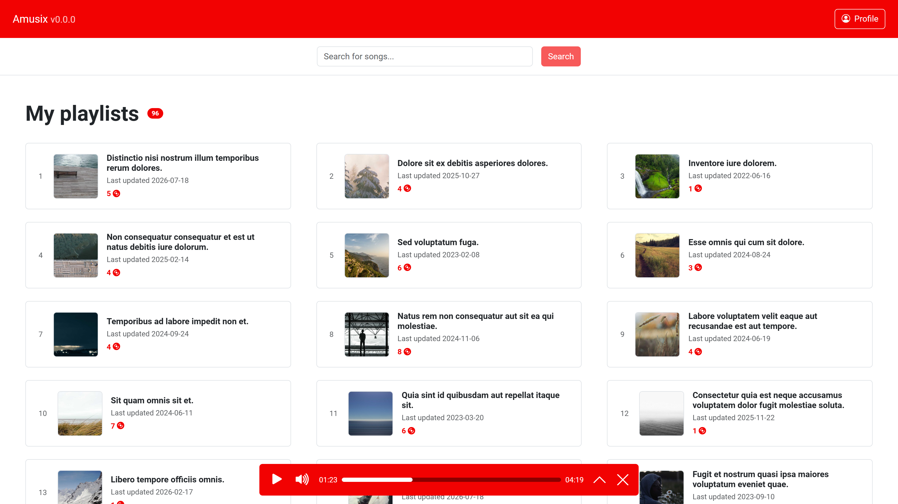
 
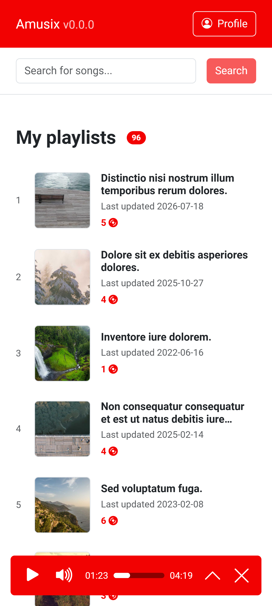

## Authentication

### Register

1. On the site's home-page, click the big "Try Amusix" button

   

2. Fill the mandatory fields of the displayed form:
    * Username:
        * Unique username to identity yourself through the application
        * At least 5 characters long
        * Only lowercase characters
        * At least one lowercase alphabetic character
        * Can contain digits
        * Can contain "-" and "_"
    * Display name: name others will see in the application
    * Password:
        * Password to access the application
        * At least 6 characters long
        * At least one digit between 0 and 9
        * At least one uppercase character
        * At least one lowercase character
        * At least one special character

    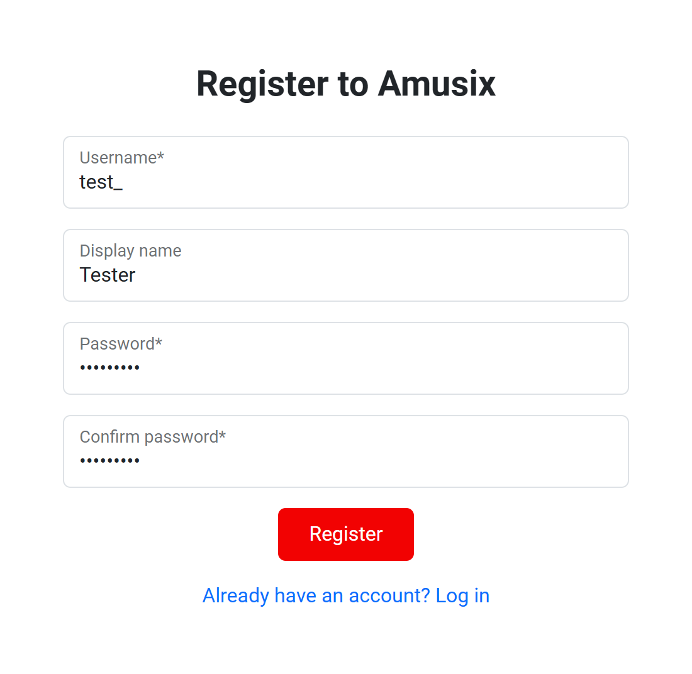

3. Confirm your password then click "Register"

4. If the registration succeed, you will be redirected to the log-in form

### Log in

1. On the site's home-page, click the "Log in" button at the top right of the page

    

2. Fill the displayed form by providing your username and password, then click "Log in"

    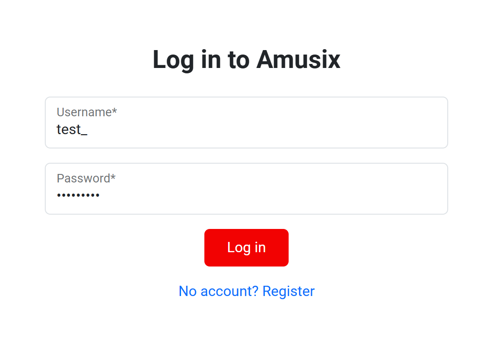

3. If the authentication succeed, you will be redirected to your playlists plage

## Songs

### Search songs

1. In the search bar bellow the application's header, enter the search text corresponding to the song you're looking for, then click "Search"

    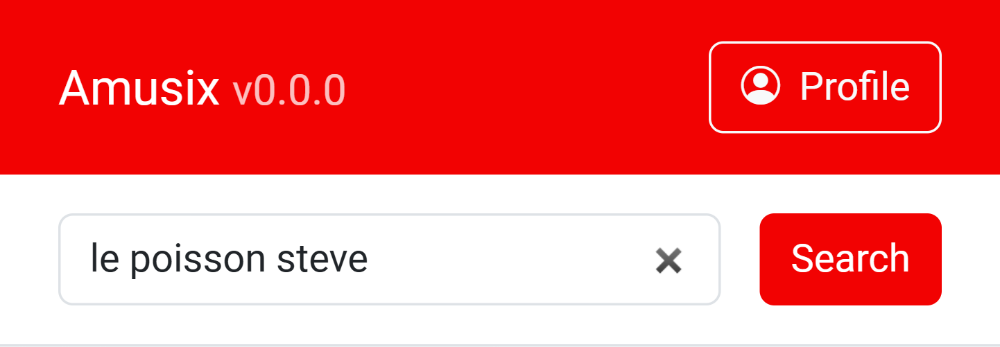

2. The results corresponding to your search text will be listed in a dedicated page

    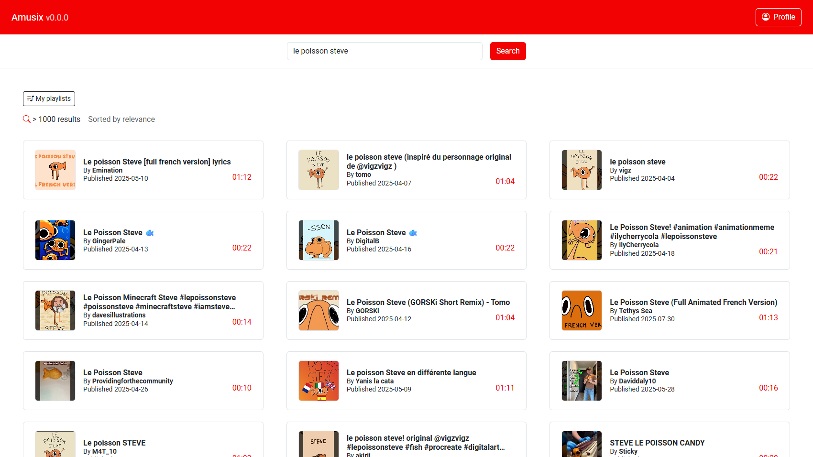

> [!TIP]
> Scroll to the bottom of the list (or click "Load more") to load more results

### Play song

1. Hover or click on one of the songs from the result list and click on the play button

    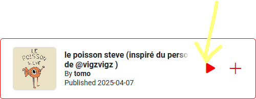

2. The song player will open to play the selected song

    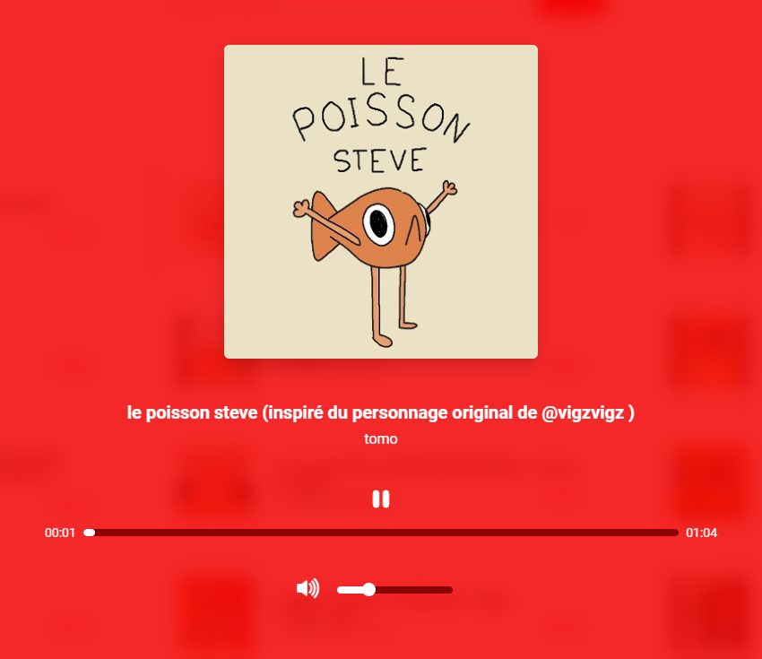

### Add song to a playlist

1. Hover or click on one of the songs from the result list and click on the plus button

    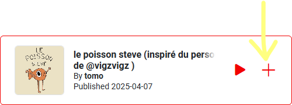

2. A window will appear to let you add the song into an existing or new playlist

#### Add song to an existing playlist

1. In the window, select the "Existing playlist" tab

2. Select the playlist you want to add the song in, then click "Add song to playlist"

    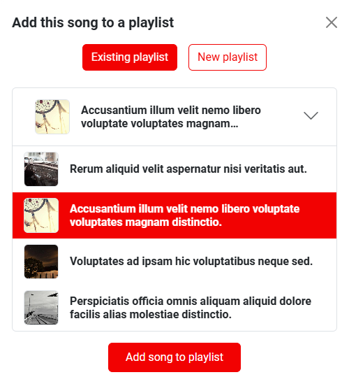

3. The song will be added to the selected playlist

#### Add song to a new playlist

1. In the window, select the "New playlist" tab

2. Enter the name of the playlist to create with song in, then click "Add song to new playlist"

    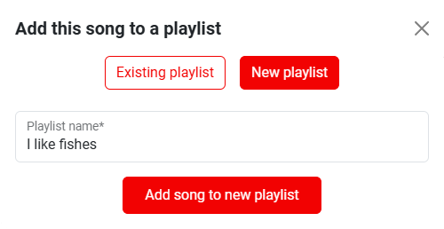

3. The playlist will be created with the song added in

## Playlists

### List playlists

You will see this page right after logging in, it displays all the playlists you created ordered by creation date

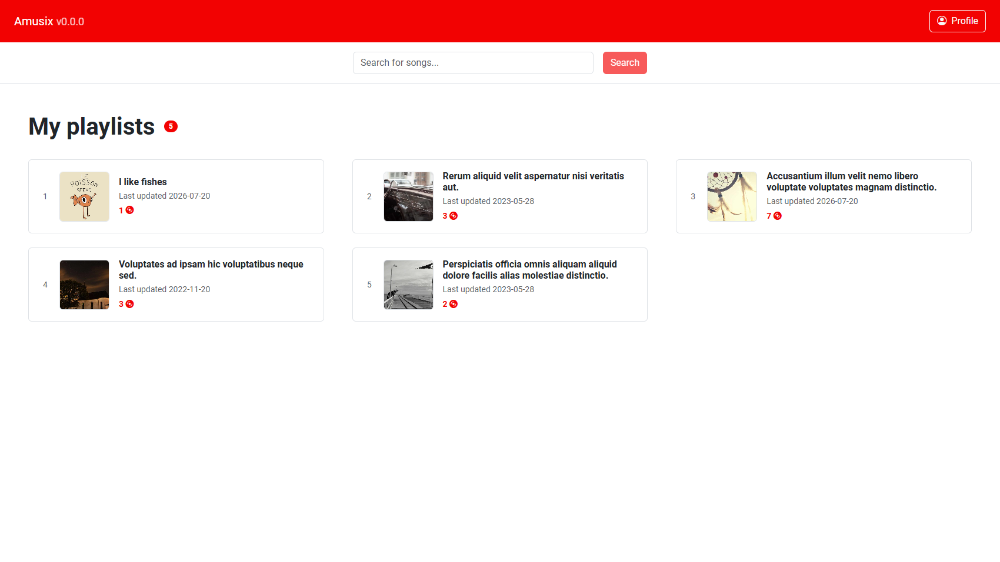

> [!TIP]
> Scroll to the bottom of the list (or click "Load more") to load more playlists

### Consult playlist

1. Click on one of the playlists displayed in the playlist listing page

    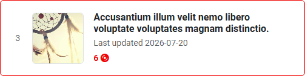

2. You will be redirected to a page showing information about the playlist and the song it contains

    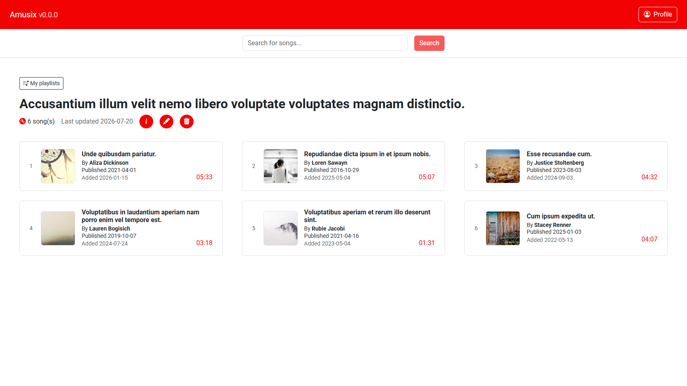

> [!TIP]
> Scroll to the bottom of the list (or click "Load more") to load more songs

### Update playlist

1. When consulting a playlist, click on the pencil button to open a window to edit the playlist

    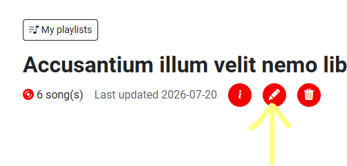

2. In the window, update the name of the playlist, then click "Save"

    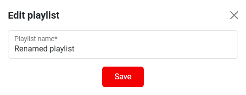

3. The playlist will be renamed accordingly

    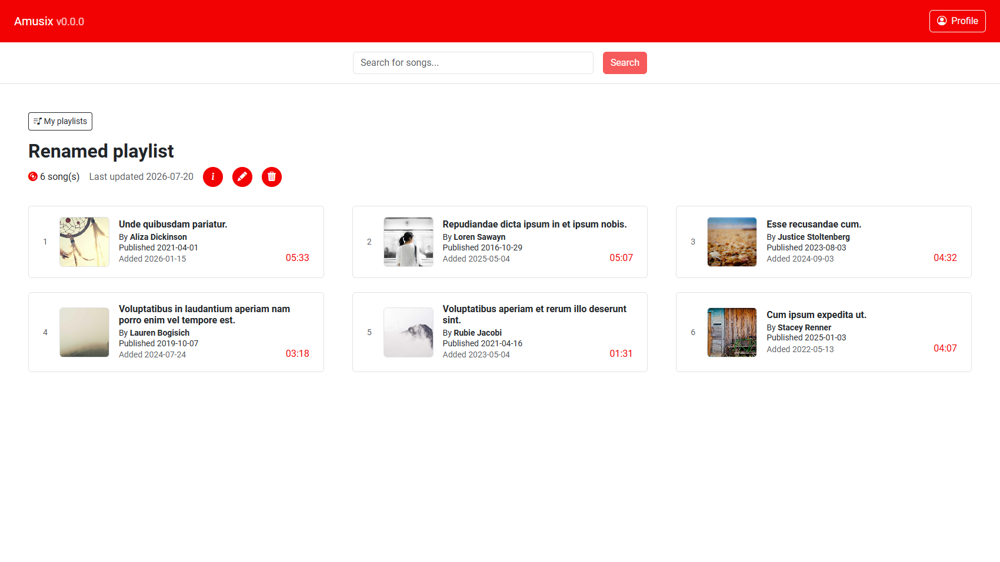

### Delete playlist

1. When consulting a playlist, click on the trash button to delete the playlist

    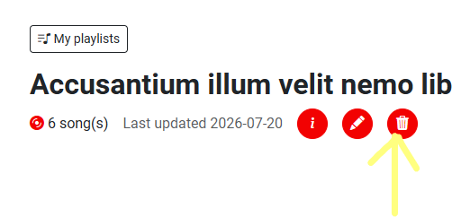

2. Confirm that you want to delete the playlist and all the songs it contains

    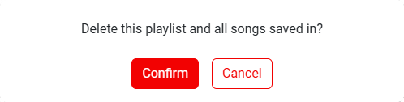

3. The playlist and all the songs it contained will be deleted

### Play song

1. Hover or click on one of the songs from the playlist and click on the play button

    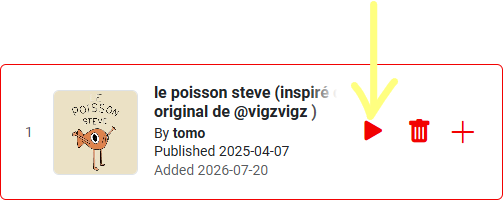

2. The song player will open to play the selected song

### Remove song from playlist

1. Hover or click on one of the songs from the playlist and click on the trash button to delete the song from the playlist

    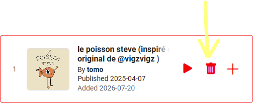

2. Confirm that you want to delete the song from the playlist

    

3. The song will be deleted from the playlist

### Add song to another playlist

Hover or click on one of the songs from the playlist and click on the plus button to open a window to add the song to another playlist
    
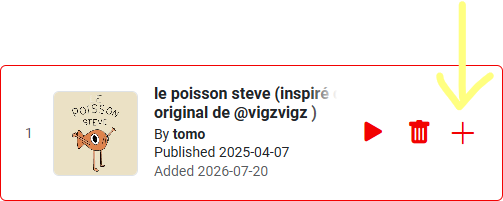

[Follow these steps to add the song to an existing playlist](#add-song-to-an-existing-playlist)

[Follow these steps to add the song to a new playlist](#add-song-to-a-new-playlist)

## Song player

### Full screen player

The full screen song player will open when playing a song or when [clicking the "^" button in the minimized player](#display-full-screen-player)

The player displays the playing song's thumbnail, name and artist name, and also offers controls for song progression and volume level

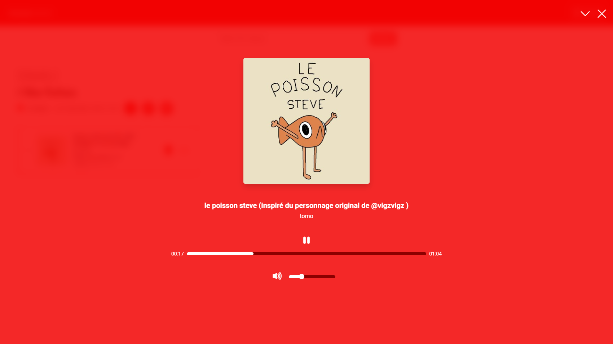

#### Minimize player

Click the "v" button in the top right corner of the player to minimize it 

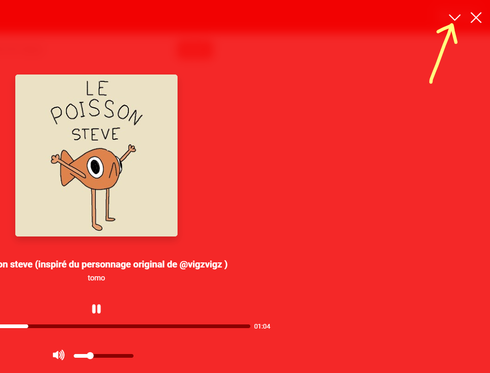

### Minimized player

The minimized song player can be displayed by [clicking on the "^" button in the full screen player](#minimize-player) 

The player only displays the song progression bar and controls, which minimizes it enough to let you do other tasks while still listening to a song

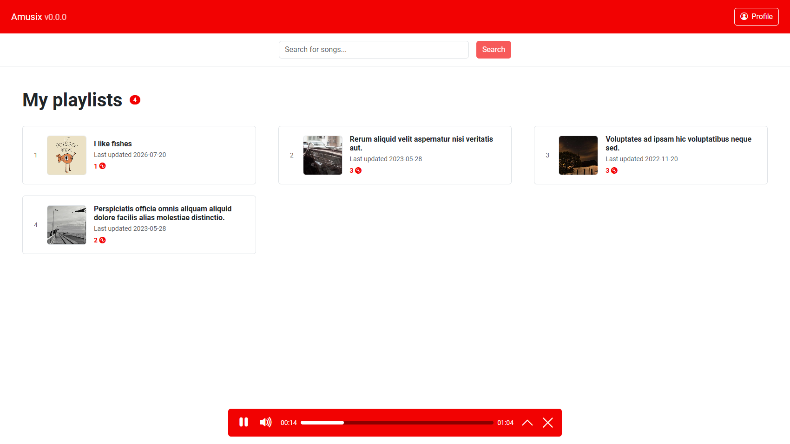

#### Display full screen player

Click the "^" button at the right of the player to display it in full screen

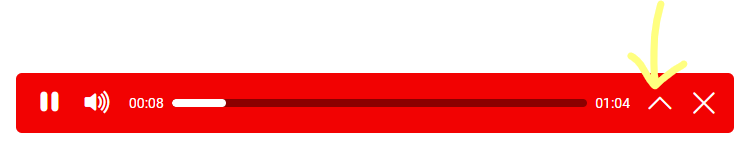

### Play / pause song

In the player click on the play / pause button to:

* Pause the playing song

    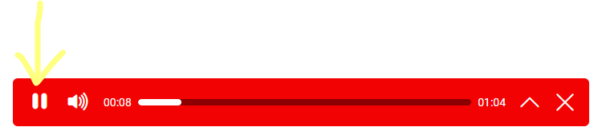

* Resume the paused song

    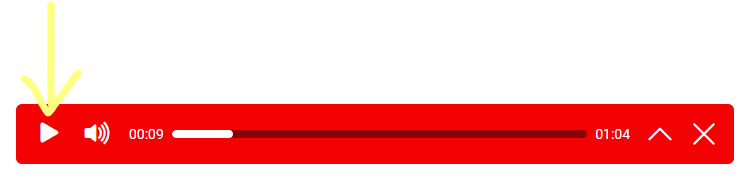

* Restart the song from the beginning if it ended

    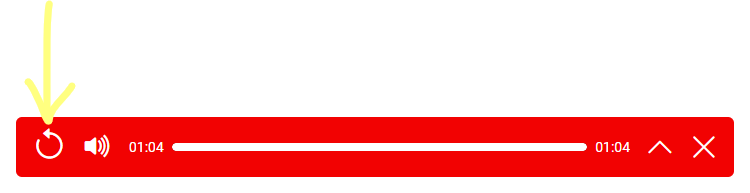

### Change song progression

The player's progression bar displays the playing song progression

Click anywhere on the bar to change the song progression to the corresponding time

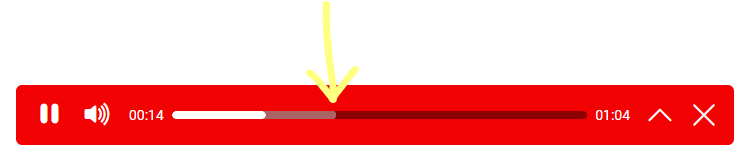

> [!NOTE]
> When viewing the minimized player on a mobile device screen, the song progression will only be displayed as read-only

### Control volume

#### Change volume level

In the minimized player, hover the volume button and click anywhere on the displayed volume bar to change the volume level

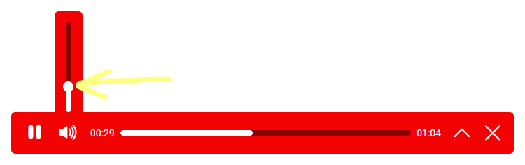

In the full screen, directly click anywhere on the displayed volume bar to change the volume level

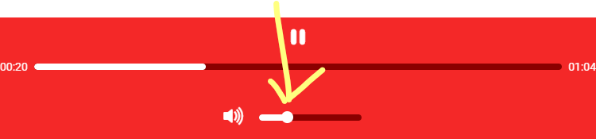

#### Mute / unmute volume

In the player, click once on the volume button to mute the volume

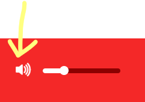

Click again to unmute the volume

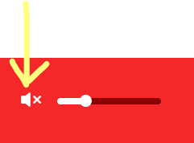

### Close player

Click on the cross in the right / top right corner of the player to close it and stop the playing song

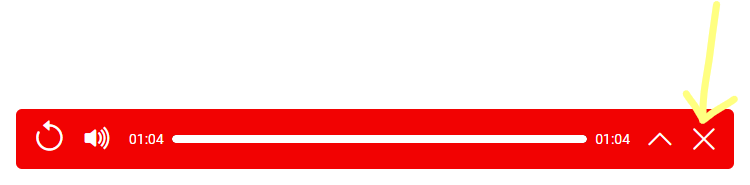

## User account

Click the "Profile" button at the right of the application's header to consult your profile page

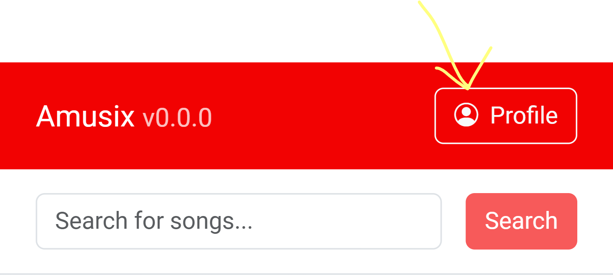

The page displays some information about your profile

### Log out

1. In your profile page, click the "Log out" button

    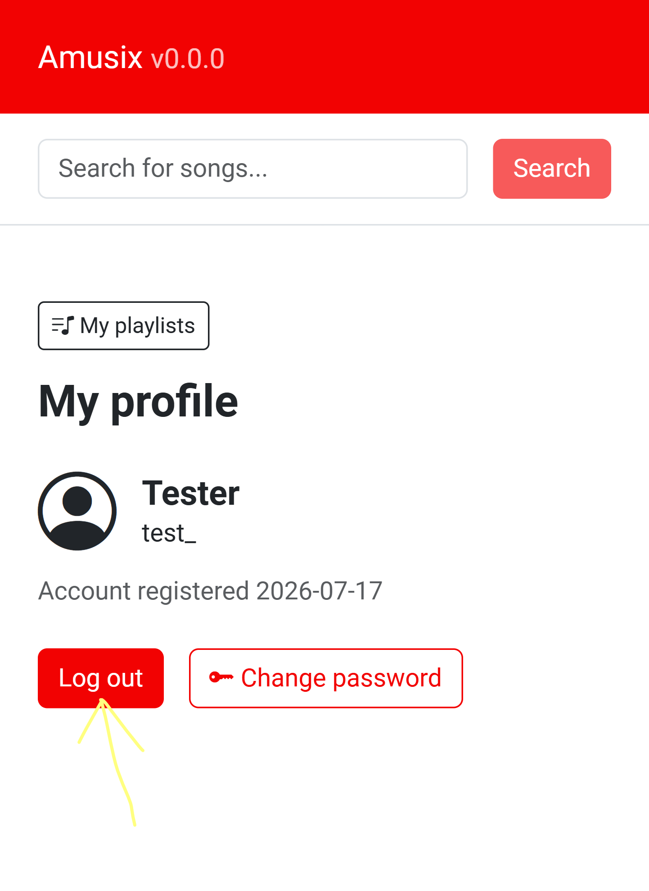

2. Confirm that you want to log out of the application

    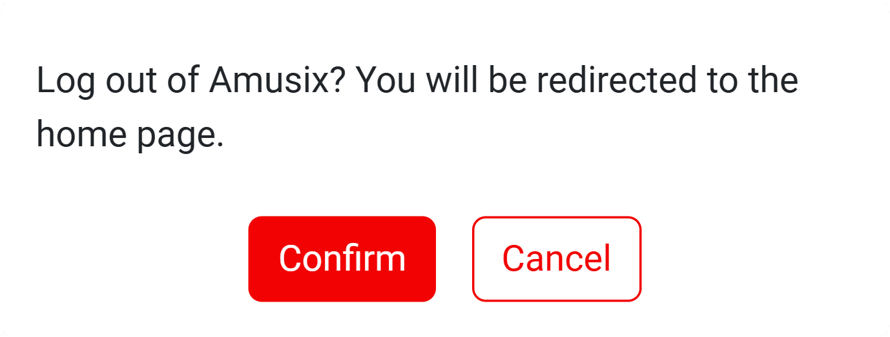

3. You will be logged out and redirected to the application's home-page

### Change password

1. In your profile page, click the "Change password" button to open a window to update your password

    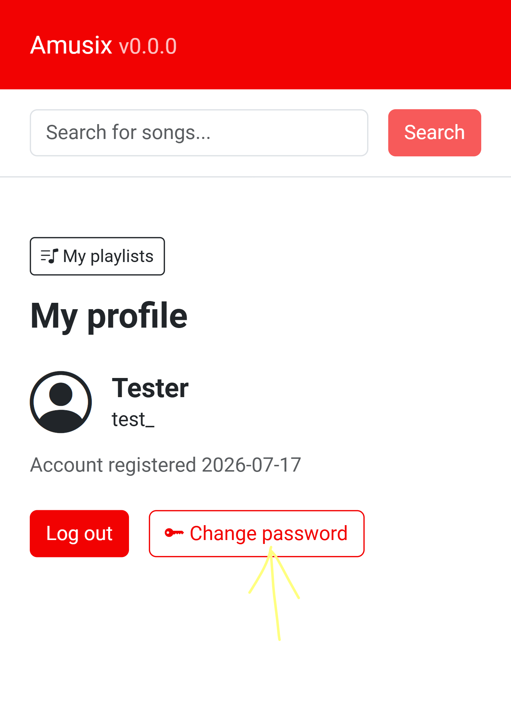
   
2. In the window, enter your current password, your new password, confirm your new password and click "Save"

    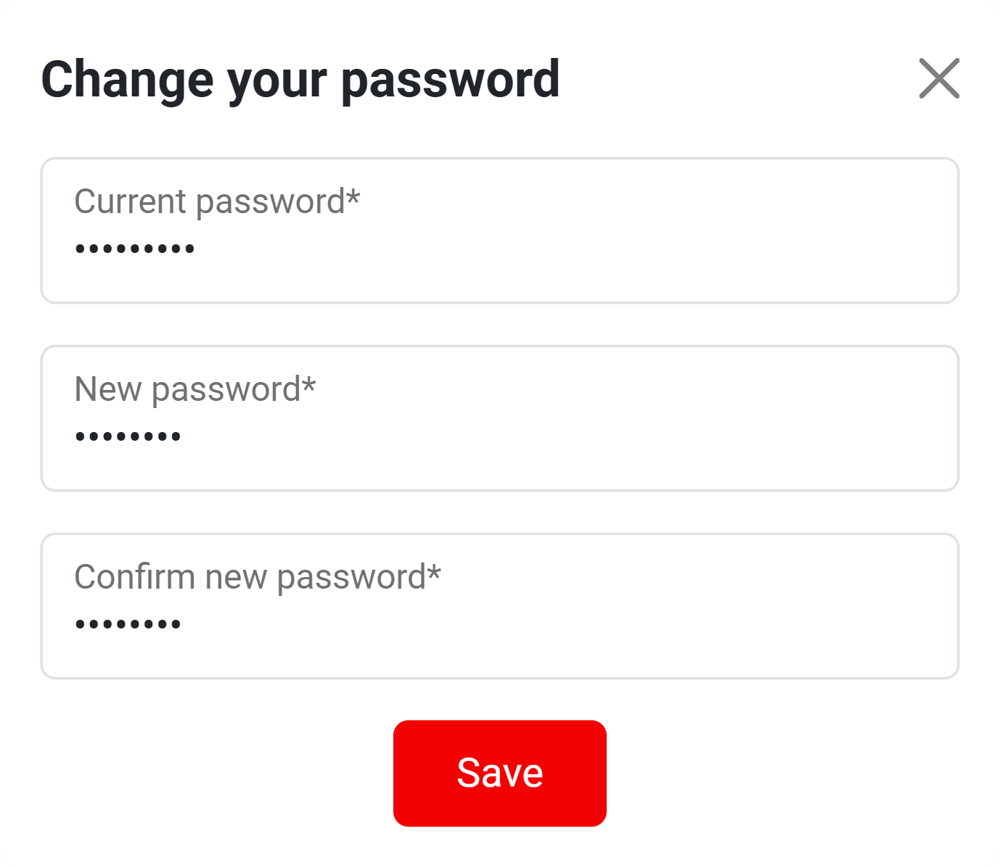

3. Confirm your password change

    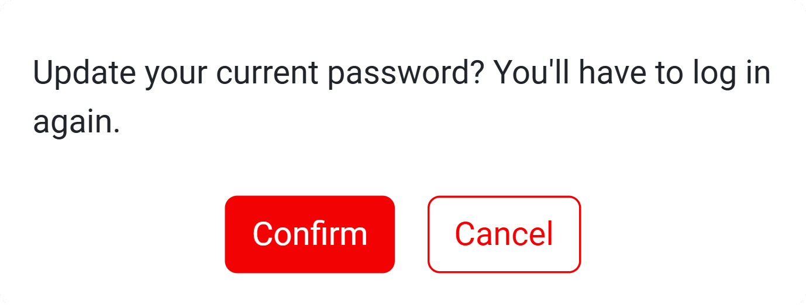

4. You will be logged out and prompted to log in again with your new password